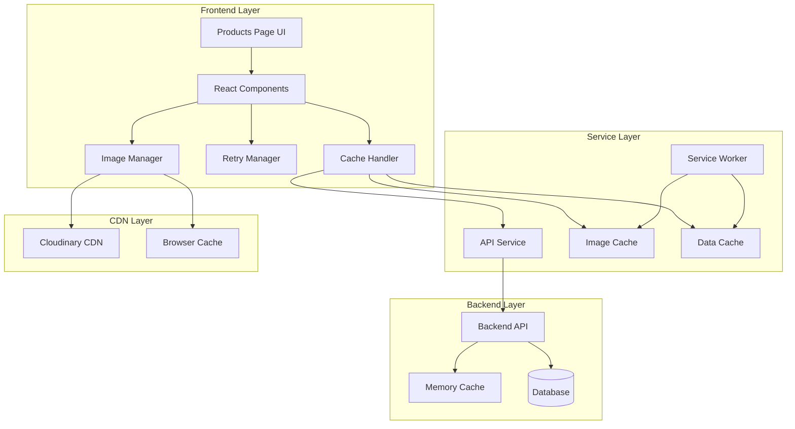
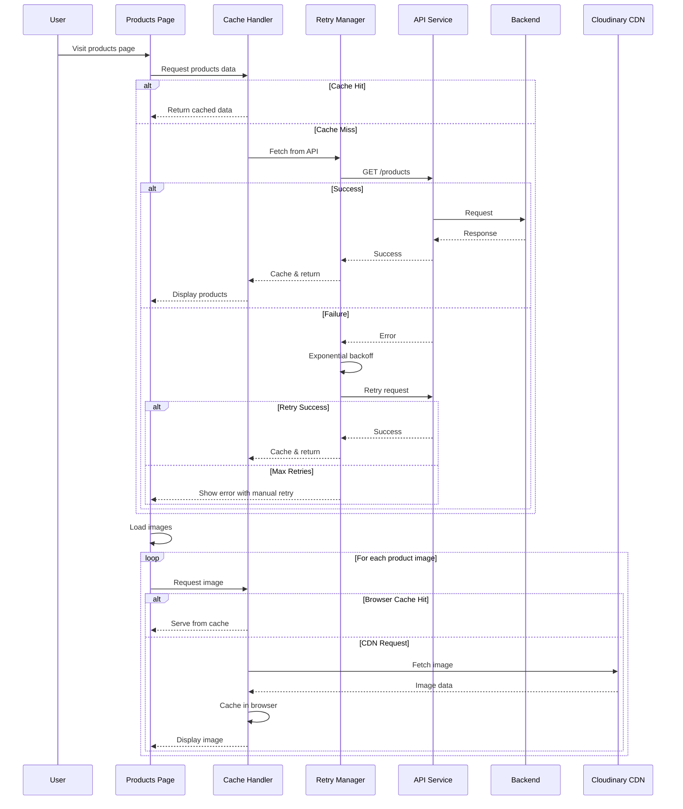

# Design Document: Product Loading Reliability

## Overview

This design addresses the intermittent loading issues affecting products and images on the products page. The solution implements a multi-layered approach combining robust error handling, intelligent caching, retry mechanisms, and performance optimizations to ensure reliable content delivery.

The design builds upon the existing architecture while introducing new reliability patterns and enhanced caching strategies to eliminate the need for multiple page refreshes.

## Architecture

### High-Level Architecture



### Request Flow with Reliability Patterns



## Components and Interfaces

### 1. Enhanced API Service Layer

#### ReliableApiService
```typescript
interface ReliableApiService {
  // Core methods with built-in retry logic
  get<T>(url: string, options?: RequestOptions): Promise<ApiResponse<T>>;
  post<T>(url: string, data: any, options?: RequestOptions): Promise<ApiResponse<T>>;
  
  // Cache management
  clearCache(pattern?: string): void;
  getCacheStats(): CacheStats;
  
  // Connection monitoring
  getConnectionStatus(): ConnectionStatus;
  onConnectionChange(callback: (status: ConnectionStatus) => void): void;
}

interface RequestOptions {
  timeout?: number;
  retries?: number;
  cacheStrategy?: 'cache-first' | 'network-first' | 'cache-only';
  cacheTTL?: number;
}

interface ApiResponse<T> {
  data: T;
  success: boolean;
  cached: boolean;
  timestamp: number;
  error?: ApiError;
}
```

#### RetryManager
```typescript
interface RetryManager {
  execute<T>(
    operation: () => Promise<T>,
    options: RetryOptions
  ): Promise<T>;
  
  getRetryState(operationId: string): RetryState;
  cancelRetries(operationId: string): void;
}

interface RetryOptions {
  maxRetries: number;
  baseDelay: number;
  maxDelay: number;
  backoffFactor: number;
  retryCondition: (error: Error) => boolean;
  onRetry?: (attempt: number, error: Error) => void;
}
```

### 2. Advanced Image Loading System

#### ImageManager
```typescript
interface ImageManager {
  // Load image with fallback chain
  loadImage(
    primaryUrl: string,
    fallbackUrls: string[],
    options: ImageLoadOptions
  ): Promise<ImageLoadResult>;
  
  // Preload images for performance
  preloadImages(urls: string[]): Promise<void>;
  
  // Cache management
  cacheImage(url: string, cacheName?: string): Promise<void>;
  getCachedImage(url: string): Promise<string | null>;
  clearImageCache(): Promise<void>;
}

interface ImageLoadOptions {
  lazy?: boolean;
  placeholder?: string;
  sizes?: string;
  priority?: 'high' | 'normal' | 'low';
  onProgress?: (loaded: number, total: number) => void;
}

interface ImageLoadResult {
  url: string;
  cached: boolean;
  fallbackUsed: boolean;
  loadTime: number;
}
```

### 3. Enhanced Caching Layer

#### CacheManager
```typescript
interface CacheManager {
  // Multi-level caching
  get<T>(key: string, options?: CacheGetOptions): Promise<T | null>;
  set<T>(key: string, value: T, options?: CacheSetOptions): Promise<void>;
  
  // Cache invalidation
  invalidate(pattern: string): Promise<void>;
  clear(): Promise<void>;
  
  // Cache statistics
  getStats(): CacheStats;
  getSize(): Promise<number>;
}

interface CacheGetOptions {
  allowStale?: boolean;
  updateInBackground?: boolean;
}

interface CacheSetOptions {
  ttl?: number;
  priority?: 'high' | 'normal' | 'low';
  tags?: string[];
}
```

### 4. Connection State Manager

#### ConnectionMonitor
```typescript
interface ConnectionMonitor {
  getStatus(): ConnectionStatus;
  isOnline(): boolean;
  getNetworkInfo(): NetworkInfo;
  
  // Event listeners
  onStatusChange(callback: (status: ConnectionStatus) => void): void;
  onSpeedChange(callback: (speed: NetworkSpeed) => void): void;
}

interface ConnectionStatus {
  online: boolean;
  speed: NetworkSpeed;
  latency: number;
  lastChecked: Date;
}

type NetworkSpeed = 'slow' | 'medium' | 'fast';
```

## Data Models

### Enhanced Product Loading State
```typescript
interface ProductLoadingState {
  products: Product[];
  loading: boolean;
  error: ApiError | null;
  
  // Enhanced state tracking
  retryCount: number;
  lastFetchTime: Date | null;
  cacheStatus: 'fresh' | 'stale' | 'none';
  connectionStatus: ConnectionStatus;
  
  // Image loading states
  imageLoadingStates: Map<string, ImageLoadingState>;
  failedImages: Set<string>;
}

interface ImageLoadingState {
  loading: boolean;
  loaded: boolean;
  error: Error | null;
  fallbackUsed: boolean;
  cached: boolean;
}
```

### Cache Entry Model
```typescript
interface CacheEntry<T> {
  data: T;
  timestamp: number;
  ttl: number;
  tags: string[];
  priority: 'high' | 'normal' | 'low';
  accessCount: number;
  lastAccessed: Date;
}
```

## Error Handling

### Error Classification System
```typescript
enum ErrorType {
  NETWORK_ERROR = 'NETWORK_ERROR',
  TIMEOUT_ERROR = 'TIMEOUT_ERROR',
  SERVER_ERROR = 'SERVER_ERROR',
  PARSE_ERROR = 'PARSE_ERROR',
  CACHE_ERROR = 'CACHE_ERROR',
  IMAGE_LOAD_ERROR = 'IMAGE_LOAD_ERROR'
}

interface ApiError {
  type: ErrorType;
  message: string;
  code?: string;
  retryable: boolean;
  timestamp: Date;
  context?: Record<string, any>;
}
```

### Circuit Breaker Pattern
```typescript
interface CircuitBreaker {
  state: 'CLOSED' | 'OPEN' | 'HALF_OPEN';
  failureCount: number;
  lastFailureTime: Date | null;
  
  execute<T>(operation: () => Promise<T>): Promise<T>;
  reset(): void;
  getState(): CircuitBreakerState;
}
```

### Error Recovery Strategies

1. **Immediate Retry**: For transient network errors
2. **Exponential Backoff**: For server errors and timeouts
3. **Circuit Breaker**: For persistent failures
4. **Graceful Degradation**: Show cached/partial content
5. **User-Initiated Recovery**: Manual retry buttons

## Testing Strategy

### Unit Testing
- Test retry logic with various error scenarios
- Validate cache hit/miss behavior
- Test image fallback chains
- Verify error classification and handling

### Integration Testing
- Test API service with real backend
- Validate caching across browser sessions
- Test offline/online transitions
- Verify image loading from CDN

### Performance Testing
- Measure cache performance impact
- Test with slow network conditions
- Validate memory usage with large datasets
- Test concurrent image loading

### End-to-End Testing
- Test complete user journeys
- Validate error recovery flows
- Test cache persistence across page reloads
- Verify accessibility of error states

## Implementation Phases

### Phase 1: Core Reliability Infrastructure
- Implement RetryManager with exponential backoff
- Create enhanced ApiService with built-in retry logic
- Add connection status monitoring
- Implement circuit breaker pattern

### Phase 2: Advanced Caching System
- Enhance browser cache utilization
- Implement multi-level cache strategy
- Add cache invalidation and management
- Create cache performance monitoring

### Phase 3: Image Loading Optimization
- Implement robust image fallback system
- Add progressive image loading
- Enhance CDN integration with proper cache headers
- Implement lazy loading with intersection observer

### Phase 4: User Experience Enhancements
- Add loading states and progress indicators
- Implement error recovery UI components
- Add offline mode support
- Create performance monitoring dashboard

### Phase 5: Monitoring and Analytics
- Implement comprehensive error logging
- Add performance metrics collection
- Create reliability monitoring dashboard
- Add automated alerting for failures

## Performance Considerations

### Caching Strategy
- **L1 Cache**: In-memory React state (immediate access)
- **L2 Cache**: Browser localStorage (persistent across sessions)
- **L3 Cache**: Service Worker cache (network-independent)
- **L4 Cache**: CDN cache (global distribution)

### Image Optimization
- Use WebP format with JPEG fallback
- Implement responsive image sizes
- Add blur-to-sharp loading transitions
- Preload critical above-the-fold images

### Network Optimization
- Batch API requests where possible
- Implement request deduplication
- Use HTTP/2 multiplexing
- Add request prioritization

### Memory Management
- Implement LRU cache eviction
- Monitor memory usage patterns
- Clean up unused image references
- Optimize React component re-renders

## Security Considerations

### Cache Security
- Validate cached data integrity
- Implement cache poisoning protection
- Use secure cache keys
- Add cache access controls

### Network Security
- Validate SSL certificates
- Implement request signing
- Add CSRF protection
- Use secure headers for cached responses

### Error Information Disclosure
- Sanitize error messages for users
- Log detailed errors securely
- Avoid exposing internal system details
- Implement rate limiting for error endpoints